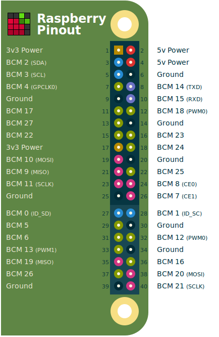

pi-blaster
==========

This project enables PWM on the GPIO pins you request of a Raspberry Pi. The
technique used is extremely efficient: does not use the CPU and gives very
stable pulses.

Pi-blaster project is based on the excellent work of Richard Hirst for
[ServoBlaster](https://github.com/richardghirst/PiBits).

## How to install

### Build and install directly from source

The build environment is based on Autotools to allow for compilation on the
Raspberry Pi, or cross-compilation.

You may need to install `autoconf` to build. On Raspbian and other Debian based
systems this can be achieved with:

    sudo apt-get install autoconf

Building is extremely simple:

    ./autogen.sh
    ./configure
    make

To start pi-blaster and have it relaunched automatically on every reboot:

    sudo make install

Or to start pi-blaster manually run:

    sudo ./pi-blaster

And to uninstall, simply run:

    sudo make uninstall

This will stop pi-blaster and prevent it from starting automatically on the next
reboot.

## How to use

pi-blaster creates a special file (FIFO) in `/dev/pi-blaster`. Any application
on your Raspberry Pi can write to it (this means that only pi-blaster needs to
be root, your application can run as a normal user).

**Important: when using pi-blaster, the GPIO pins you send to it are configured
as output.**

To set the value of a PIN, you write a command to `/dev/pi-blaster` in the form
`<GPIOPinName>=<value>` where `<value>` must be a number between 0 and 1
(included).

You must use the GPIO number (BCM xx in the diagram below).

Examples:

  * To completely turn on GPIO pin 17:

    echo "17=1" > /dev/pi-blaster

  * To set GPIO pin 17 to a PWM of 20%

    echo "17=0.2" > /dev/pi-blaster

  * To turn off GPIO pin 17:

    echo "17=0" > /dev/pi-blaster

  * To release a pin so it can be used as digital GPIO or an input:

    echo "release 17" > /dev/pi-blaster

## Warnings and other caveats

**Pins being used by pi-blaster will be configured as outputs. Do not plug
something on an input or you might destroy it!**

This daemon uses the hardware PWM generator of the raspberry pi to get precise
timings. This might interfere with your sound card output.  There is
experimental support for a PCM time-source. If you are interested, I suggest you
look at Richard Hirst original project (ServoBlaster) and try the `--pcm`
option.

## A practical example: high-power RGB lighting

This library was developed for TBideas high power LED driver. You can read more
about this project on [our blog][blog].

## Contributors

* Richard Hirst for [ServoBlaster](https://github.com/richardghirst/PiBits)
* Thomas Sarlandie (https://github.com/sarfata)
* Michael Vitousek (https://github.com/mvitousek/pi-blaster)
* Pete Nelson (https://github.com/petiepooo)
* Edgar Siva (https://github.com/edgarsilva)
* Alex Lennon (https://github.com/ajlennon)
* Lara Maia (https://github.com/LaraCraft304)
* Pattrick Hüper (https://github.com/phueper)
* Boyuan Yang (https://github.com/hosiet)
* penfold42 (https://github.com/penfold42)
* Thomas McVay (https://github.com/ThomasMcVay)

## Want to support this project?

The best way to contribute is to write code for the features you would like to
see and to make a pull-requests.

## License

Released under The MIT License.

Note: This project was initially released by Richard Hist under the GPL v3
License. Richard gave me explicit permission to distribute this derivative work
under the MIT License.

    Copyright (c) 2013 Thomas Sarlandie - Richard Hirst

    Permission is hereby granted, free of charge, to any person obtaining a copy
    of this software and associated documentation files (the "Software"), to
    deal in the Software without restriction, including without limitation the
    rights to use, copy, modify, merge, publish, distribute, sublicense, and/or
    sell copies of the Software, and to permit persons to whom the Software is
    furnished to do so, subject to the following conditions:

    The above copyright notice and this permission notice shall be included in
    all copies or substantial portions of the Software.

    THE SOFTWARE IS PROVIDED "AS IS", WITHOUT WARRANTY OF ANY KIND, EXPRESS OR
    IMPLIED, INCLUDING BUT NOT LIMITED TO THE WARRANTIES OF MERCHANTABILITY,
    FITNESS FOR A PARTICULAR PURPOSE AND NONINFRINGEMENT. IN NO EVENT SHALL THE
    AUTHORS OR COPYRIGHT HOLDERS BE LIABLE FOR ANY CLAIM, DAMAGES OR OTHER
    LIABILITY, WHETHER IN AN ACTION OF CONTRACT, TORT OR OTHERWISE, ARISING
    FROM, OUT OF OR IN CONNECTION WITH THE SOFTWARE OR THE USE OR OTHER DEALINGS
    IN THE SOFTWARE.

[blog]:
http://www.tbideas.com/blog/2013/02/controling-a-high-power-rgb-led-with-a-raspberry-pi/
